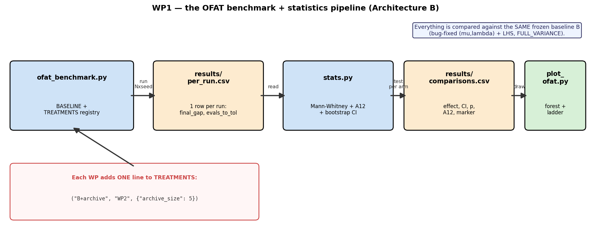
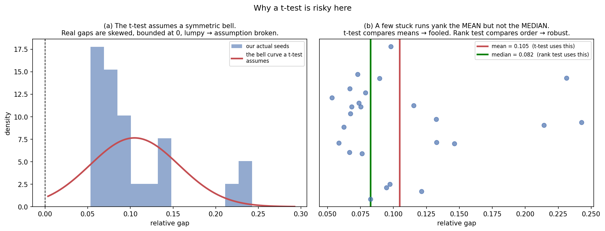
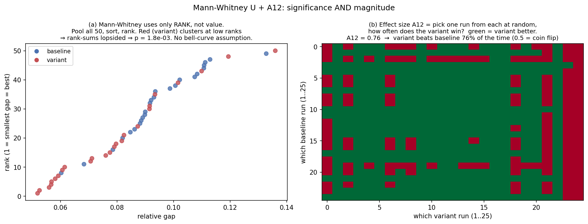

# WP1 — baseline + benchmarking framework (team guide)

**Read this before you benchmark your improvement.** It covers the two things you
need: (1) the **core statistics** we use, and (2) **how the pipeline works** and
how to plug your change in. Deeper dives: [`statistics-guide.md`](statistics-guide.md)
(stats from scratch) and [`bug-fixes.md`](bug-fixes.md) (the baseline fixes).

WP1 delivers a **correct baseline** (4 bugs fixed — see `bug-fixes.md`) and a
**shared way to measure improvements** so each of ours gets an honest,
significance-tested verdict against the *same* baseline.



---

## 1 · The method: OFAT against a frozen baseline

We use **OFAT — One-Factor-At-A-Time**. There is **one frozen baseline B**
(bug-fixed, `(μ,λ)`, LHS init, **SINGLE_VARIANCE**). Every improvement = B with
**exactly one thing changed**, compared against **the same B**, over
**25 seeds × n ∈ {7,10,15,20}**. Because only your factor changes, the measured
effect is **yours alone, unconfounded** by anyone else's change.

> **Why single-variance for B?** It's the simplest, cheapest, most standard ES
> default — the neutral reference. WP4's σ-strategy ablation showed single wins
> at every n (multiple/full are slower to adapt and don't beat it in our budget),
> so single is the honest baseline and multiple/full are WP4 **ablation arms**,
> not the baseline. (Changed from FULL_VARIANCE on 2026-06-01.)

The headline output is a **forest plot** — one row per improvement:


- **dot** = how much you improved the median result (right = better),
- **whisker** = bootstrap 95% confidence interval (the uncertainty),
- **filled** = statistically significant, **hollow** = not,
- **A12** = effect size (below). *(Figure illustrative until the full sweep runs.)*

---

## 2 · The core statistics (the essentials)

We compare two clouds of 25 numbers (baseline vs your arm) and ask: **real
improvement, or just lucky seeds?** Three things to know:

**p-value** — the chance of seeing a gap this big *if there were no real
difference*. Small p (< 0.05) ⇒ unlikely to be luck ⇒ real effect. We use the
**Mann–Whitney U test**, not a t-test, because our results are skewed and have
outliers (stuck runs), which break the t-test's bell-curve assumption:



**A12 (effect size)** — "pick one baseline run and one of yours at random; how
often does yours win?" 0.5 = coin flip (no effect), 0.76 = yours wins 76% of the
time. **Always reported next to p**, because with 25 seeds a *tiny, useless*
difference can still be "significant" — A12 tells you if it's actually big:



**Rule for the slides:** a claim counts only if it's **significant (p < 0.05)**
*and* has an **A12 clearly above 0.5**. (That's Arthur's "significance + no blind
trying".)

> Parked for now: the Holm multiple-comparison correction and Fisher's-exact for
> success rate. The pipeline stores what's needed to add them later.

---

## 3 · How to add YOUR improvement (the pipeline)

The data flow is in the diagram above: `ofat_benchmark.py` runs everything →
`per_run.csv` → `stats.py` → `comparisons.csv` → `plot_ofat.py`. You touch
**two files** and run **three commands**.

### Step A — make your change a NO-OP-by-default toggle in `EvoPy`

Your arm is `BASELINE` + one changed kwarg, so that kwarg must exist in `EvoPy`
with a default that **changes nothing** (or you break everyone's runs). Example
already in the code: `init="lhs"` (`ES/evopy/evopy.py:26`, used at `:186`).

> ⚠️ **Gotcha:** `Individual.reproduce()` does **not** auto-forward kwargs to its
> children (this was one of the bugs we fixed). If your feature lives in
> `Individual`, thread it through *every* child construction or it silently
> reverts after generation 0.

Per WP:
- **WP2 (Ivan):** `(μ+λ)` already works via `selection_scheme="plus"`. Archive →
  add `archive_size=0` (0 = off), keep a top-K store in `run()` (loop at
  `evopy.py:112`, best at `:150`); use it only for the returned best /
  reintroduction, not for reproduction.
- **WP3 (Cala):** repair is split (reflect at `individual.py:86`, random-resample
  at `:116-117`). Unify into `_repair(genotype, mode)` + a `repair="reflect"`
  kwarg threaded `EvoPy → Individual`. Modes: `random|clip|reflect|projector`.
- **WP4 (Agata):** σ-strategy is already `strategy=`; ablation arms just set
  `{"strategy": MULTIPLE_VARIANCE}` / `{"strategy": FULL_VARIANCE}` vs the single
  baseline. Recombination is implemented (`recombine=`, `recombination_mode=`).
  See `improvements/WP4/README.md` for the agreed framing.
- **WP5 (Martin):** add `local_search="none"`; `"final"` = one L-BFGS-B polish
  after the loop, `"interleaved"` = every K gens. Charge gradient evals to
  `self.evaluations`.

### Step B — add ONE line to the registry (`ofat_benchmark.py:69`)

```python
TREATMENTS = [
    ("baseline",  "WP1", {}),
    ("B-no_lhs",  "WP1", {"init": "uniform"}),
    ("B+archive", "WP2", {"archive_size": 5}),       # <- you add a line like this
]
```

### Step C — run three commands

```bash
uv run --with numpy ofat_benchmark.py              # -> results/per_run.csv
uv run --with scipy --with numpy stats.py          # -> results/comparisons.csv (your p + A12)
uv run --with matplotlib --with numpy plot_ofat.py # -> plots_wp1/forest_*.png
```

**Rebase your branch onto `bugfix/ta-handoff` first**, so you're on the fixed
baseline.

---

## 4 · One thing about convergence

We log two metrics per run, so the comparison never collapses: **`final_gap`**
(quality — how close you ended) and **`evals_to_<tol>`** (speed — how fast you got
there). On easy `n` everyone converges and `final_gap` saturates (the test
correctly says "no difference") — but the **speed** metric still separates a
faster variant. On hard `n` it's the reverse. `stats.py` reports both, so a real
improvement always shows up somewhere.

---

## 5 · The full sweep

The default config in `ofat_benchmark.py` *is* the full sweep: every treatment ×
`n ∈ {7,10,15,20}` × **25 seeds** × **100 000 evals**. (Smoke runs shrink these
to test the plumbing — those numbers are noise.) 25 seeds is what gives the test
enough to separate signal from luck. The single-variance baseline is cheap; arms
that switch to FULL_VARIANCE (e.g. WP4's σ-ablation) are much slower — budget the
time for those.
