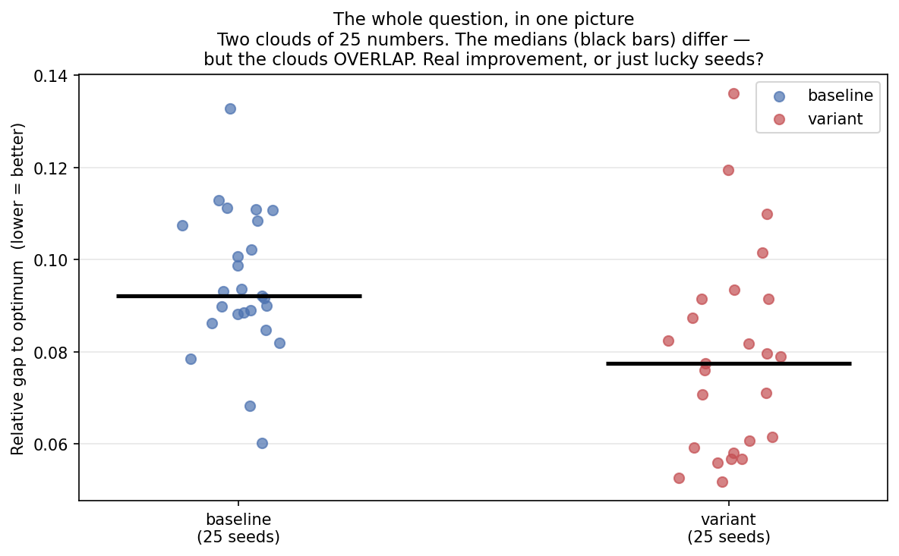
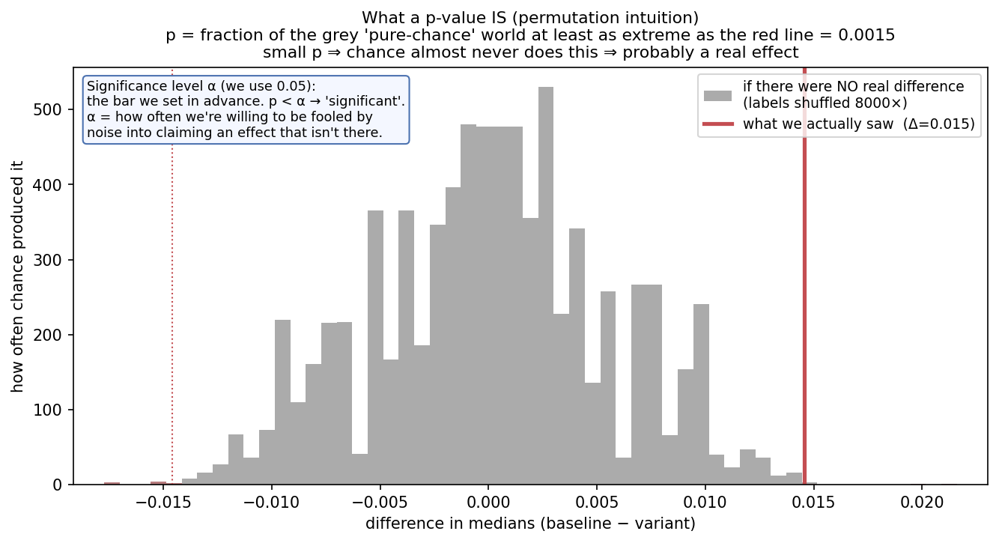
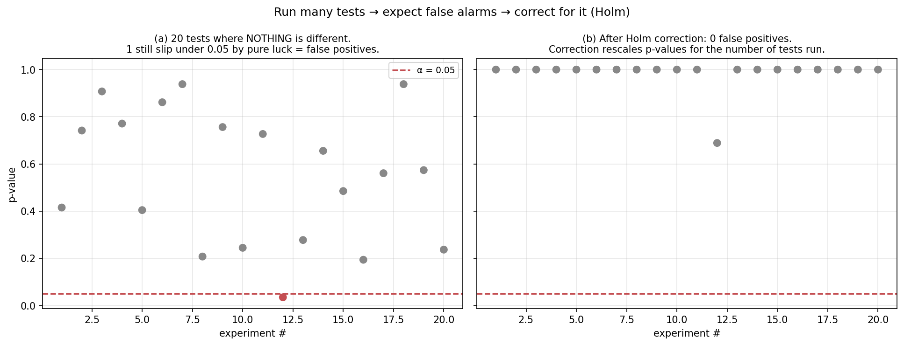

# Statistics, from scratch

> Goal: by the end you can read our forest plot, know what `p = 0.002 **` and
> `A12 = 0.76` mean, and explain *why we don't use a t-test* if Arthur asks.
> No prior stats assumed. Figures are illustrative (fake data, real maths).

---

## 0 · What we are even comparing — seeds, runs, samples

Our algorithm is **random**. Run it twice and you get two different answers,
because it makes random choices along the way (where the circles start, how each
mutation jiggles them, etc.). A **seed** is just the starting number for that
randomness:

- Same seed → *exactly* the same run, every time (reproducible).
- Different seed → a different run.

So when we "run 25 seeds", we run the **same algorithm 25 times with seeds
0,1,…,24**, and get **25 final answers** — 25 numbers. For us each number is the
**final gap to the optimum** (how far from the Packomania best we ended up;
lower = better).

> **A "sample" = those 25 numbers.** It is *not* one averaged number. We keep
> all 25, because their *spread* is the whole point (see §1).

**What does a seed actually control?** Everything random in one run:
the Latin-hypercube starting layout of the circles, **and** every mutation and
selection step for the whole run. (More on Latin-hypercube and "are they even
random" in [the chat answer / §A].) One seed pins the entire trajectory.

**Why 25?** One run could be lucky or unlucky. 25 runs show the *range* of
behaviour, and — crucially — let us ask whether a difference between two
algorithms is **real** or just **luck of the seeds**. That question is the rest
of this guide.

---

## 1 · The one question all of this answers

Here are two algorithms, 25 seeds each. Baseline vs a variant we hope is better:



The variant's median (black bar) is lower (better). **But the two clouds
overlap** — plenty of baseline runs beat plenty of variant runs. So:

> Is the variant **genuinely** better, or did we just get a luckier set of seeds
> this time?

Everything below is machinery for answering that one question honestly, instead
of eyeballing two medians and declaring victory.

---

## 2 · The p-value: "how surprising is this, if nothing really changed?"

Imagine the variant is actually **no better** — the two clouds are really the
same thing, and any gap we saw is pure seed-luck. If that were true, the labels
"baseline" and "variant" would be **meaningless stickers**. So: pool all 50
numbers, randomly re-stick 25 "baseline" and 25 "variant" labels, and measure
the median difference. Do that thousands of times. That builds a picture of
**what differences pure luck produces when there's no real effect** — the grey
histogram:



The red line is **what we actually observed**. The **p-value** is simply:

> **p = the fraction of the grey "pure-luck" world that is at least as extreme
> as what we saw.**

- Big p (red line sits in the fat middle of grey) → "luck does this all the
  time" → **no evidence** of a real effect.
- Small p (red line out in the thin tail, like here, p = 0.0015) → "luck almost
  never does this" → **good evidence** the variant really is different.

**Significance level α.** We pick a bar *in advance* — conventionally
**α = 0.05**. If `p < α` we call it "significant". α is the **risk we accept of
being fooled by noise**: at α = 0.05, even when nothing is truly different, we'll
wrongly shout "significant!" about 5% of the time. (That 5% becomes a real
problem when we run many tests — §5.)

> p is **not** "the probability the variant is better" and **not** "the size of
> the improvement". It only measures *how surprising the data is if there were
> no difference*. Size is a separate question — §4.

---

## 3 · Why a t-test is risky here

The famous **t-test** answers a similar question but takes a shortcut: it assumes
each cloud is a **symmetric bell curve (a normal distribution)** and compares
their **means**. Both assumptions misfire on our data:


- **(a) The shape is wrong.** Gaps can't go below 0, and a few runs get *stuck*
  far from the optimum — so the real distribution is **skewed and lumpy**, not a
  symmetric bell. The bell the t-test imagines even puts weight on *negative*
  gaps, which are impossible. When the assumption is false, the t-test's p-value
  is simply **not trustworthy** — it can declare significance that isn't there,
  or miss it.
- **(b) The mean is fragile.** A handful of stuck runs **drag the mean** sideways
  while the **median barely moves**. The t-test compares means → it gets yanked
  around by a couple of unlucky runs. We care about *typical* behaviour, which
  the median captures and the mean doesn't.

We also only have **25 seeds** (small), so we can't lean on "with enough data the
t-test is fine anyway". Hence: **use a test that makes none of these
assumptions.**

---

## 4 · What we actually use: Mann–Whitney U + A12

> **First, untangle three things people mix up.** There is **no such thing as
> "a p-test"**:
> - A **p-value** is a *number* (how surprising the data is if nothing differs).
> - A **test** is the *procedure* that computes that number from your data. The
>   familiar "simple" one is the **t-test** — but it *also* just outputs a
>   p-value. So we never chose "p-value vs Mann–Whitney"; we chose **which test
>   computes the p-value**. The t-test's assumptions are broken here (§3);
>   Mann–Whitney's aren't — and it's **no harder to run** (`mannwhitneyu(a,b)`
>   vs `ttest_ind(a,b)`, one line either way). The t-test isn't *simpler*, just
>   more *familiar*; we lose nothing by using the right one.
> - **A12 is neither a test nor a p-value.** It answers a *different* question.
>   The p-value says *"is the difference real?"*; A12 says *"how big is it?"*.
>   So it isn't "Mann–Whitney + A12 *instead of* a p-test" — Mann–Whitney
>   **gives** the p-value, and A12 **adds** the size on top.

**Mann–Whitney U** throws away the raw magnitudes and uses only the **order** —
the ranks:


- **(a)** Pool all 50 numbers, sort them, and give them ranks 1…50 (rank 1 =
  smallest gap = best). If the variant (red) genuinely tends to be better, its
  values **pile up at the low ranks**, and the rank-totals of the two groups come
  out **lopsided**. How lopsided → the p-value. Because it only looks at order,
  **no bell-curve assumption** is needed, and a single stuck run is just "the
  worst rank", not a number that distorts a mean. This is exactly the robustness
  §3 said we needed.
- **(b) Effect size A12** answers the *"by how much?"* question p-values ignore.
  It's beautifully plain: **pick one baseline run and one variant run at random;
  how often does the variant win?** Here **A12 = 0.76 → the variant beats the
  baseline 76% of the time**. 0.5 = coin flip (no effect), 1.0 = always wins.

> **Always report both.** `p` says *"is the effect real?"*; `A12` says *"is it
> big enough to care?"*. With 25 seeds a microscopic, useless difference can
> still be "significant" — A12 stops us overselling it. (Cliff's δ is the same
> information rescaled to [−1, 1]; pick one and be consistent.)

Mann–Whitney is essentially the permutation idea from §2, done on ranks — so §2
*is* the intuition for the test we actually run.

---

## 5 · Many tests → expect false alarms → correct for them

Architecture B runs **a lot** of these tests (every WP arm vs the baseline). The
α = 0.05 catch from §2 bites hard here. Watch 20 tests where **nothing is truly
different**:



- **(a)** ~1 in 20 still sneaks under 0.05 **by pure luck** — a **false
  positive**. Run 40 tests and you'd expect ~2 bogus "discoveries". If we don't
  account for this, we'll present noise as a finding and the defense will catch
  it.
- **(b) Holm–Bonferroni correction** rescales the p-values for *how many tests we
  ran*, pushing the lucky false alarms back above 0.05. After correction: 0 false
  positives.

> **Is the correction "on top of" Mann–Whitney?** Yes — it's a **separate, later
> step**, and it's about *how many tests you ran*, not *which test* you used
> (you'd correct t-test p-values the same way). The full pipeline:
>
> ```
> each arm's 25 seeds ──Mann-Whitney──▶ raw p per arm ──Holm──▶ corrected p ──▶ p < α=0.05 ?
>                          └──────────────────────────────────────▶ A12 (size; computed
>                                                                       alongside, NOT corrected)
> ```
>
> Run **one** test and there's nothing to correct. Run **many** (every WP arm vs
> the baseline) and you must, or ~1-in-20 noise results sneaks through.

**Our rule:** correct **within each WP family** of tests (each branch's set of
arms is one family). It's a few lines of code — see `make_figures.py`'s `holm()`.

---

## 6 · How to read our results: the forest plot

**What a "forest plot" is.** The name comes from medical meta-analysis, where
dozens of studies are stacked in one chart so you see the whole "forest" of
results at a glance. Each **row is one comparison**, read left-to-right:

- a **dot** = the estimated effect (for us: how much an arm improves the median
  gap vs the baseline),
- a **horizontal line** through the dot = the uncertainty (a bootstrap 95%
  confidence interval — resample the seeds many times, see how much the effect
  wobbles),
- a **vertical reference line** = "no effect" (= the baseline).

Rows whose dot *and* whole interval sit clearly to one side of the line are real
effects; rows straddling the line are inconclusive. It's the right plot for us
because Architecture B produces **one comparison per arm**, and a forest plot
shows *all* of them — direction, size, and significance — in a single glance,
which is exactly what a 9-minute defense needs.

Our version adds, per row:

- **dot position** = improvement vs baseline (right = better),
- **whisker** = bootstrap 95% CI,
- **filled dot** = significant (`p < 0.05`); **hollow** = not,
- **`A12` label** = the effect size (win probability).

A claim only makes the slide if it's **filled (significant)** *and* has an
**A12 meaningfully above 0.5 (big enough)** — the bar Arthur's "significance
almost everywhere / no blind trying" is asking for.

---

## 7 · One-screen cheat-sheet

| Term | Plain meaning | Gotcha |
|---|---|---|
| **seed** | starting number for the run's randomness | same seed = identical run |
| **sample** | our 25 per-seed final gaps | keep all 25, not the average |
| **distribution** | the shape/spread of those 25 | overlap is why we need stats |
| **null hypothesis** | "there's no real difference" | the strawman we try to knock down |
| **p-value** | how surprising the data is *if* the null were true | NOT the size, NOT P(better) |
| **α (0.05)** | the "significant" threshold, set in advance | = our tolerated false-alarm rate |
| **t-test** | compares means, assumes a bell curve | risky: our data is skewed + has outliers |
| **Mann–Whitney U** | compares *ranks*, assumes nothing | what we use |
| **A12 / Cliff's δ** | effect size = P(variant beats baseline) | report it *alongside* p |
| **Holm correction** | rescales p for running many tests | kills lucky false positives |

---

## A · Appendix — the seed questions, answered

- **"Is it an average of the seed runs?"** No. The 25 seeds give a *distribution*
  of 25 outcomes. For curves we plot the **median + IQR band** across seeds; for
  the stats test the **25 values themselves are the sample**. Averaging would
  throw away the spread, which is the very thing the test needs.
- **"What does a seed affect — the starting positions?"** That, **and more**: the
  seed drives the run's whole random number stream — initial layout *and* every
  mutation/selection step. (Note for WP1: the current code only propagates the
  seeded stream for SINGLE_VARIANCE; MULTIPLE/FULL variance children fall back to
  the global RNG, so those two strategies aren't fully seed-reproducible — a real
  WP1 fix. See `bug-fixes.md`.)
- **"Are positions even random under Latin-hypercube sampling?"** Yes — LHS is
  *stratified* randomness, not a fixed grid. It chops each coordinate's [0,1]
  range into 25 equal slices and drops exactly one sample in each slice, at a
  **random** spot within the slice, then shuffles which slice pairs with which.
  So you get the **even coverage** of a grid but with **randomness** (controlled
  by the seed) — no clustering, no gaps. Different seed → different LHS layout.

---

## B · Appendix — the actual math

For the report and the defense. (Obsidian renders the LaTeX below.)

### B.1 · How Mann–Whitney U gives a p-value

Two samples: group 1 (size $n_1$) and group 2 (size $n_2$); total $N = n_1+n_2$.
For us $n_1 = n_2 = 25$, $N = 50$.

**Step 1 — rank.** Pool all $N$ values, sort ascending, assign ranks $1..N$
(rank 1 = smallest gap). **Ties** get the *average* of the ranks they would
occupy ("midranks") — e.g. two values tied for ranks 4–5 each get $4.5$.

**Step 2 — rank sums.** Let $R_1$ = sum of group 1's ranks. (Always
$R_1 + R_2 = \tfrac{N(N+1)}{2}$, a useful check.)

**Step 3 — the U statistic.**
$$U_1 = R_1 - \frac{n_1(n_1+1)}{2}, \qquad U_2 = R_2 - \frac{n_2(n_2+1)}{2}, \qquad U_1 + U_2 = n_1 n_2.$$

$U_1$ has a concrete meaning: it **counts, over all $n_1 \times n_2$ pairs
(one run from each group), how many times group 1's value is larger** (ties
count $\tfrac12$). That is *exactly* the effect-size picture from §4(b):

$$\boxed{\,A_{12} = \frac{U_1}{n_1 n_2}\,}$$

So **U and A12 are the same quantity** — $U$ is the raw win-count, $A_{12}$ is
that count turned into a fraction. The test statistic and the effect size come
from one computation.

**Step 4 — turn U into a p-value.** Two ways:

- **Exact (the definition).** Under the null "labels are meaningless", every one
  of the $\binom{N}{n_1}$ ways to split the pooled ranks into two groups is
  equally likely. Enumerate them → the exact null distribution of $U$ →
  $p = $ proportion of splits with $U$ at least as extreme as observed. **This is
  literally the §2 permutation test, run on ranks instead of raw values.**
- **Normal approximation (what runs for $n=25$).** For samples this size
  `scipy` uses the fact that, under the null, $U$ is approximately normal:
$$\mu_U = \frac{n_1 n_2}{2}, \qquad \sigma_U^2 = \frac{n_1 n_2 (N+1)}{12}.$$
  With ties, the variance shrinks by a correction term:
$$\sigma_U^2 = \frac{n_1 n_2}{12}\!\left[(N+1) - \frac{\sum_j (t_j^3 - t_j)}{N(N-1)}\right],$$
  where $t_j$ is the size of the $j$-th group of tied values. Then standardise
  (with an optional $\pm\tfrac12$ continuity correction) and read off the tail:
$$z = \frac{U - \mu_U}{\sigma_U}, \qquad p_{\text{two-sided}} = 2\,\Phi(-|z|),$$
  where $\Phi$ is the standard-normal CDF. **Our numbers:** $\mu_U = \frac{25\cdot25}{2} = 312.5$ and
  $\sigma_U = \sqrt{\frac{625\cdot 51}{12}} \approx 51.5$, so $z = (U-312.5)/51.5$.

### B.2 · How Holm–Bonferroni rescales the p-values

Inputs: $m$ raw p-values $p_1,\dots,p_m$ (one per arm) and the level $\alpha$.
Goal: keep the chance of **any** false positive across the whole family
$\le \alpha$ (the *family-wise error rate*).

**Plain Bonferroni** (the ancestor): reject when $p_i \le \alpha/m$ — i.e.
multiply every p-value by $m$. Safe but harsh: every test pays the *full* $m$
penalty.

**Holm** keeps the guarantee but penalises less, by going in order:

1. Sort ascending: $p_{(1)} \le p_{(2)} \le \dots \le p_{(m)}$.
2. Walk down the list; the $k$-th smallest is compared to a threshold that
   **relaxes as you go**:
$$\text{reject } H_{(k)} \ \text{while}\ \ p_{(k)} \le \frac{\alpha}{\,m - k + 1\,}.$$
   Stop at the **first** $k$ that fails; retain it and everything after it.

So the smallest p faces $\alpha/m$ (as harsh as Bonferroni), the next $\alpha/(m-1)$,
…, the largest just $\alpha/1 = \alpha$. As **adjusted p-values** (what
`holm()` returns, so you can compare directly to $\alpha$):
$$\tilde p_{(k)} = \min\!\Big(1,\ \max_{j \le k} (m - j + 1)\,p_{(j)}\Big).$$
The inner $\max$ enforces monotonicity (an adjusted p can't be smaller than one
ranked below it); the outer $\min$ caps at 1.

**Worked example** (the six arms from fig 4, $m = 6$, $\alpha = 0.05$):

| rank $k$ | raw $p_{(k)}$ | multiplier $m{-}k{+}1$ | $\times$ | running max = $\tilde p_{(k)}$ | verdict |
|---|---|---|---|---|---|
| 1 | 0.004 | 6 | 0.024 | 0.024 | **reject** (✓ < .05) |
| 2 | 0.012 | 5 | 0.060 | 0.060 | retain |
| 3 | 0.031 | 4 | 0.124 | 0.124 | retain |
| 4 | 0.042 | 3 | 0.126 | 0.126 | retain |
| 5 | 0.048 | 2 | 0.096 | 0.126 | retain |
| 6 | 0.180 | 1 | 0.180 | 0.180 | retain |

Only arm 1 survives — four arms that looked "significant" raw ($p<.05$) are
correctly demoted once you account for having run six tests. Because Holm's
multipliers $(m{-}k{+}1)$ are all $\le m$, it **never rejects less than
Bonferroni** (strictly more powerful) while keeping the same family-wise
guarantee.
