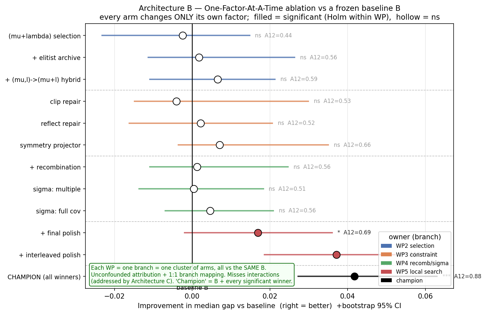

# WP1 — the baseline and how we measure improvements

WP1 gives the team three things:

1. **An honest baseline.** Four correctness bugs in the original code are fixed
   (no selection pressure, the τ learning-rate, the rotation-angle index, and a
   reproducibility leak). Details in `improvements/bug-fixes.md`. Until these
   were fixed, the multi-σ strategies and the per-seed statistics weren't
   trustworthy.
2. **A fair, shared way to measure any improvement** — so each of us gets a real
   verdict on our change, not a hand-wavy "looks better".
3. **One improvement of its own** — Latin-hypercube initialisation — measured
   with that same method (see "LHS" below).

## How we measure an improvement (one picture)

We freeze **one baseline B**. Every improvement changes **exactly one thing** on
top of B, and is compared against **the same B**, over **25 seeds × n ∈ {7,10,15,20}**.
Each comparison becomes one dot:



- dot to the **right of the line** = it improved on the baseline;
- **filled** = the difference is statistically real, **hollow** = could be luck;
- the **A12** next to it = how big the effect is.

This is "one-factor-at-a-time": because only your factor changes, the result is
**yours, unconfounded** — nobody else's change is mixed in. (Figure is
illustrative for now.)

## What the two numbers mean (30-second version)

- **p-value** — *is the difference real, or just lucky seeds?* Small p (< 0.05)
  = real. We use the **Mann–Whitney** test (not a t-test — our results are
  skewed and have outliers, which a t-test mishandles).
- **A12 (effect size)** — *how big is it?* "Pick one baseline run and one of
  yours at random; how often does yours win?" 0.5 = coin flip, 0.76 = yours wins
  76% of the time. We report this **next to** every p, because a tiny useless
  difference can still be "significant".

Full plain-English explainer: **[statistics-guide.md](statistics-guide.md)**.

## How to add YOUR improvement

Add **one line** to `TREATMENTS` in `ofat_benchmark.py` — your label, your WP,
and the single kwarg your change flips:

```python
TREATMENTS = [
    ("baseline",  "WP1", {}),
    ("B-no_lhs",  "WP1", {"init": "uniform"}),
    ("B+archive", "WP2", {"archive_size": 5}),     # <- you add this kind of line
]
```

Then `uv run --with numpy ofat_benchmark.py` (writes `results/per_run.csv`) and
`uv run --with scipy --with numpy stats.py` (writes `results/comparisons.csv`
with your p-value + A12). That's it — same baseline, same stats, for everyone.

### What "the full sweep" means

A *sweep* = running the benchmark across the **entire grid** of conditions, not
one cheap corner. The **full sweep** is:

> every treatment  ×  every problem size `n ∈ {7, 10, 15, 20}`  ×  all **25 seeds**  ×  the full **100 000-evaluation** budget.

(While developing we use cheap **smoke** runs — a couple of `n`, ~8 seeds, a few
thousand evals — just to check the plumbing; those numbers are noise.) Only the
full sweep gives results solid enough to put a p-value on: **25 seeds** is what
lets the Mann–Whitney test separate a real effect from seed-luck, and the full
`n` range shows whether an improvement holds as the problem gets harder. The
default config in `ofat_benchmark.py` *is* the full sweep — just
`uv run --with numpy ofat_benchmark.py`. It's slow on FULL_VARIANCE, so budget
the time (or run overnight).

## Two things to know

- **If everything converges** (easy n, both reach the optimum), the *quality*
  metric `final_gap` saturates and correctly shows "no difference". The runner
  also logs **speed** (`evals_to_<tol>`), so we just compare *how fast* instead —
  a faster-converging variant is still a real win. `stats.py` reports both.
- **LHS as our improvement.** Latin-hypercube init lives *in* the baseline, but
  we still measure its contribution by **ablation**: compare B against `B-no_lhs`
  (plain uniform init). That's the `B-no_lhs` arm above — it shows how much the
  stratified start actually buys us.

## Where things live

| File | What |
|------|------|
| `bug-fixes.md` (this folder) | the 4 baseline correctness fixes |
| `ofat_benchmark.py` | the treatment registry + per-run runner → `per_run.csv` |
| `stats.py` | Mann–Whitney + A12 per (arm, n, metric) → `comparisons.csv` |
| [statistics-guide.md](statistics-guide.md), comparison-architectures (team working notes) | the why, in depth |

*(Parked for now: Holm multiple-comparison correction, and Fisher's-exact for
success-rate — added later if/when we need them. See the comparison-architectures design (team working notes).)*
